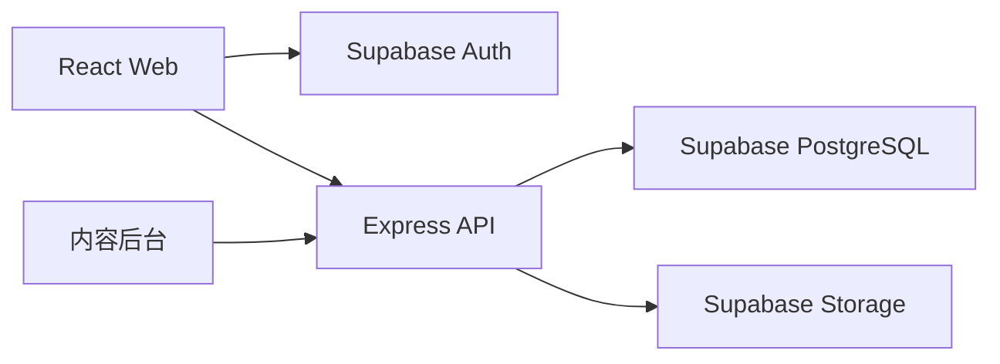

# AquaGuide 三层数据契约

> 版本：2.2.0
> 状态：已确认，实施中
> 生效日期：2026-07-22
> SQL 来源：`supabase/migrations/202607160001_core_schema.sql`、`supabase/migrations/202607160002_localization.sql`、`supabase/migrations/202607220001_livestock_batches.sql`、`202607220002_atomic_livestock_batch_split.sql`、`202607220003_atomic_livestock_memorial.sql`、`202607220004_atomic_livestock_batch_merge.sql`、`202607220005_fix_livestock_batch_merge_signature.sql`
> TypeScript 来源：`src/types/database.ts`

## 1. 产品与架构边界

AquaGuide 面向水族新手，提供鱼缸管理、物种选择、混养判断、巡检、养护补救和个人水族册。

正式架构：



- 前端仅使用 Supabase Auth 获取会话，不直接读写业务表。
- 登录用户的业务数据以 PostgreSQL 为唯一事实来源。
- 游客继续使用本地 Repository；登录后先预览并确认迁移。
- 混养、巡检、今日行动和成就由确定性规则派生，AI 不能覆盖规则结论。
- AI 原始回复和巡检自由描述默认不持久化。
- 数据库使用 `snake_case`；API、共享类型和前端统一使用 `camelCase`，转换只发生在 API 层。
- 中文主数据继续作为确定性规则的稳定输入；本地化只改变展示文本，不改变规则结论。
- 侧栏与页头的任务入口只能进入正式路由或可定位模块，不得由导航直接打开业务弹窗。
- 缸内体态属于养护与诊断上下文，不得改变混养四态结论。

### 1.1 任务式路由

- `/search?q=`：统一搜索物种与养护指南。
- `/identify`：拍照识别与手动物种确认。
- `/settings`：语言与已上线设置。
- `/welcome`：首次使用目标选择。

深链接必须定位、高亮并聚焦目标；目标不存在时显示可见错误，不得静默失败。

### 1.2 新手引导状态

`OnboardingState` 保存在现有 `LocalAppState` 中；登录用户同步到 `profiles.preferences`，不新增独立存储键或数据表。仅在没有引导状态、鱼缸、收藏和记录时自动进入 `/welcome`。

```ts
type OnboardingGoal = 'build_tank' | 'browse_species';
interface OnboardingState {
  version: 1;
  status: 'pending' | 'completed' | 'skipped';
  goal?: OnboardingGoal;
  viewedSpecies: boolean;
  taskCardDismissed: boolean;
  completedAt?: string;
}
```

### 2.1 语言与回退

```ts
type SupportedLocale = 'zh-CN' | 'en';

interface LocalizedContentMeta {
  requestedLocale: SupportedLocale;
  resolvedLocale: SupportedLocale;
  usedFallback: boolean;
}
```

- 首次访问按浏览器语言选择，用户主动选择后保存为 `LocalePreference`。
- 内容接口必须显式接收 `locale`，并在响应中返回 `LocalizedContentMeta`。
- 英文翻译不存在或未发布时安全回退中文，并将 `usedFallback` 设为 `true`。
- 英文入口正式开放前，物种、喂养资料、养护文章和步骤的已发布覆盖率必须为 100%。

## 2. 通用约束

所有业务实体使用 UUID 主键。内容同时保留唯一 `catalog_key`，兼容现有字符串物种和文章 ID。

所有可变表包含：

```ts
interface SyncFields {
  createdAt: string;
  updatedAt: string;
  deletedAt?: string;
  version: number;
}
```

- `createdAt / updatedAt / deletedAt` 为 ISO 8601 时间字符串。
- `version` 从 1 开始，每次更新由数据库触发器递增。
- 更新请求必须提交当前版本；不一致返回 `409 VERSION_CONFLICT`。
- 写接口必须提交 `Idempotency-Key`；同一键重复提交不得产生重复数据。
- 删除默认使用 `deletedAt`；账号删除、鱼缸删除等明确生命周期操作按外键策略级联。

## 3. 内容实体

### 3.1 SpeciesRecord

物种包含 UUID、`catalogKey`、中英文名、分类、难度、温度/pH 文本与可计算范围、换水周期、描述、食性、缸体要求、性情、体型、混养说明、检索词和发布状态。

发布状态：

```ts
type ContentStatus = 'draft' | 'published' | 'archived';
```

只有 `published` 且未删除内容可被普通用户读取。

### 3.2 SpeciesFeedingProfileRecord

每个物种最多一条喂食画像，包含食性、食物、频率、分量规则、活动水层、禁忌、资料来源、可信度和待复核状态。

### 3.3 SpeciesAssetRecord

```ts
type AssetVariant =
  | 'original'
  | 'thumbnail'
  | 'detail'
  | 'texture'
  | 'article_main'
  | 'article_step';
```

物种素材保存 Storage 桶、路径、格式、尺寸、字节数、SHA-256、资源版本和当前版本状态。同一物种、同一用途只能有一个当前资源。

### 3.4 CareArticleRecord

养护文章包含 UUID、`catalogKey`、标题、分类、紧急度、摘要、症状、禁止动作、观察项、诊断时机、下一步、关键词与发布状态。

### 3.5 CareArticleStepRecord / CareArticleAssetRecord

- 操作步骤按文章内 `position` 唯一排序。
- 步骤可包含时间说明。
- 文章素材支持主图和步骤图，同一文章或步骤的同一用途只能有一个当前资源。

### 3.6 翻译实体

新增四张翻译表，不复制中文主数据：

- `species_translations`
- `species_feeding_profile_translations`
- `care_article_translations`
- `care_article_step_translations`

每条翻译包含父实体、`locale`、发布状态、审核人、审核时间和通用同步字段。父实体与语言唯一。普通用户只有在父内容与翻译均为 `published` 时才能读取；草稿、审核和发布仅管理员可操作。

## 4. 用户业务实体

### 4.1 Profile / UserRoleRecord

- `profiles` 保存昵称和非敏感偏好，不复制认证凭据。
- `profiles.preferences` 可保存 `locale` 与 `onboarding`；新设备仅在本地没有选择时读取云端引导状态，本地操作失败同步时不得阻断游客使用。
- `user_roles` 保存 `user | admin`，普通用户不能修改自己的角色。

### 4.2 AquariumWithRelations

鱼缸拆分为：

- `aquariums`：用户、名称、水体、长宽高、目标温度、最近换水与困水时间。
- `aquarium_species`：物种、兼容 `speciesCatalogKey`、数量、入缸日期。
- `aquarium_equipment`：过滤、加热、增氧、灯光；每缸最多一条。
- `aquarium_components`：底砂、水草和硬景。

同一鱼缸内同一 `speciesCatalogKey` 只能保留一条有效记录，追加数量通过更新完成。

### 4.3 DiagnosisRecordRow

保存结构化答案、本地规则结论、风险、行动、禁止动作、观察项、缺失信息与复查时间。约束：

- 同一用户的 `diagnosisKey` 唯一。
- 同一鱼缸、同一自然日最多一条 `problemType = "巡检"` 的有效记录。
- AI 原始回复和自由描述原文不得写入本表。

### 4.4 收藏、纪念和养护

- `species_favorites`：用户与物种唯一。
- `care_favorites`：用户与文章唯一。
- `memorial_records`：用户、可选鱼缸、可选物种 UUID、兼容物种键、日期和复盘原因。
- `care_reminders`：用户、可选鱼缸、来源文章、计划日期和完成时间。
- `care_events`：换水、喂食、观察和清单完成事件。
- 同一文章、同一鱼缸只能有一条未完成养护计划。

### 4.5 MigrationBatchRecord

迁移批次包含用户、幂等键、本地版本、状态、预览摘要、结果摘要、错误摘要和提交时间。

状态：

```ts
type MigrationStatus = 'previewed' | 'committing' | 'completed' | 'failed';
```

### 4.6 IdempotencyRecord

后端为写请求保存用户、幂等键、请求方法、路径、请求哈希、资源引用、响应状态和过期时间。同一用户的幂等键唯一；相同键但请求哈希不同必须返回 `409 DUPLICATE_RESOURCE`，不能复用旧结果。

### 4.7 SpeciesRecognitionMissRecord

拍照识别未命中只保存匿名聚合元数据：图片 SHA-256 指纹、视觉模型名称与版本、候选标签、候选内容键、出现次数和可选的最终确认内容键。

- 不保存原图、EXIF、用户身份、鱼缸资料或症状原文。
- 相同指纹、模型和模型版本只保留一条记录并累加次数。
- 普通用户不能直接查询；仅后端 `service_role` 可聚合写入和补充最终确认结果。
- Supabase 未配置时仅保留当前会话状态，界面必须明确显示“云端未记录”。

## 5. RLS 与 Storage

### 5.1 数据库策略

| 资源 | Select | Insert / Update / Delete |
|---|---|---|
| 已发布物种、文章及其公开素材记录 | 所有人 | 管理员 |
| 草稿与下线内容 | 管理员 | 管理员 |
| `profiles` | 本人 | 本人 |
| `user_roles` | 本人或管理员 | 管理员 |
| 鱼缸和所有鱼缸子数据 | 所有者 | 所有者 |
| 巡检、收藏、纪念、养护与迁移 | 所有者 | 所有者 |
| 已发布翻译且父内容已发布 | 所有人 | 管理员 |
| `species_recognition_misses` | 无客户端权限 | 后端 `service_role` |

所有鱼缸子表都通过鱼缸外键再次验证 `aquariums.owner_id = auth.uid()`，不能只相信请求中的用户 ID。

### 5.2 Storage

- `catalog-originals`：私有原图，只有管理员可读写。
- `catalog-public`：公开衍生图，所有人可读、只有管理员可写。
- 单文件原图上限 20MB，公开衍生图上限 10MB。
- 允许 PNG、JPEG 和 WebP。
- 正式路径包含内容键、资源版本与用途，禁止覆盖同一路径伪装成新版本。

## 6. API 通用协议

基础路径：`/api/v1`。

```ts
interface ApiSuccess<T> {
  data: T;
  requestId: string;
}

interface ApiFailure {
  error: {
    code: ApiErrorCode;
    message: string;
    details?: unknown;
  };
  requestId: string;
}

type ApiErrorCode =
  | 'VALIDATION_ERROR'
  | 'AUTH_REQUIRED'
  | 'FORBIDDEN'
  | 'NOT_FOUND'
  | 'VERSION_CONFLICT'
  | 'DUPLICATE_RESOURCE'
  | 'PAYLOAD_TOO_LARGE'
  | 'MIGRATION_REJECTED'
  | 'RATE_LIMITED'
  | 'INTERNAL_ERROR'
  | 'DEPENDENCY_UNAVAILABLE';
```

分页使用 `cursor` 和 `limit`，响应返回 `items` 与可选 `nextCursor`。默认 24，最大 100。

## 7. API 列表

### 7.1 内容

| Method | Path | Request | Response | 主要错误 |
|---|---|---|---|---|
| GET | `/species` | `locale cursor? limit? category? query?` | `Page<SpeciesSummary>` | 400/503 |
| GET | `/species/:catalogKey` | `locale` | `SpeciesWithRelations` | 404/503 |
| GET | `/care-articles` | `locale cursor? limit? category? urgency? query?` | `Page<CareArticleSummary>` | 400/503 |
| GET | `/care-articles/:catalogKey` | `locale` | `CareArticleWithRelations` | 404/503 |

普通内容接口只返回已发布内容。管理员内容列表通过 `/admin` 接口读取草稿和下线内容。

### 7.2 鱼缸

| Method | Path | Request | Response | 主要错误 |
|---|---|---|---|---|
| GET | `/aquariums` | 无 | `AquariumWithRelations[]` | 401/503 |
| POST | `/aquariums` | 鱼缸字段，Header 幂等键 | `AquariumWithRelations` | 400/401/409 |
| GET | `/aquariums/:id` | 路径参数 | `AquariumWithRelations` | 401/403/404 |
| PATCH | `/aquariums/:id` | 可变字段、`version` | `AquariumWithRelations` | 400/401/404/409 |
| DELETE | `/aquariums/:id` | `version` | `{ deleted: true }` | 401/404/409 |
| POST | `/aquariums/:id/species` | 物种键、数量、日期、初始体态、幂等键 | `AquariumSpeciesRecord` | 400/401/404/409 |
| PATCH | `/aquariums/:id/species/:recordId` | 日期、`version`；数量仅允许单批次兼容更新 | `AquariumSpeciesRecord` | 400/401/404/409 |
| DELETE | `/aquariums/:id/species/:recordId` | `version` | `{ deleted: true }` | 401/404/409 |
| POST | `/aquariums/:id/species/:recordId/batches` | 数量、入缸日期、生长阶段、繁殖状态、幂等键 | `AquariumSpeciesBatchRecord` | 400/401/404/409 |
| PATCH | `/aquariums/:id/species/:recordId/batches/:batchId` | 可变字段、`version` | `AquariumSpeciesBatchRecord` | 400/401/404/409 |
| POST | `/aquariums/:id/species/:recordId/batches/:batchId/split` | 拆分数量、新体态、`sourceVersion`、幂等键 | `AquariumSpeciesBatchRecord[]` | 400/401/404/409 |
| POST | `/aquariums/:id/species/:recordId/batches/:batchId/merge` | 来源批次、最终入缸日期/生长阶段/繁殖状态、双方版本 | `AquariumSpeciesBatchRecord[]` | 400/401/404/409 |
| POST | `/aquariums/:id/species/:recordId/batches/:batchId/memorial` | 日期、原因、批次版本、幂等键 | `MemorialRecord` | 400/401/404/409 |
| DELETE | `/aquariums/:id/species/:recordId/batches/:batchId` | `version` | `{ deleted: true, speciesRemoved: boolean }` | 401/404/409 |
| PUT | `/aquariums/:id/equipment` | 设备字段、可选 `version` | `AquariumEquipmentRecord` | 400/401/404/409 |
| POST | `/aquariums/:id/components` | 类型、名称、数量、幂等键 | `AquariumComponentRecord` | 400/401/404/409 |
| PATCH | `/aquariums/:id/components/:componentId` | 可变字段、`version` | `AquariumComponentRecord` | 400/401/404/409 |
| DELETE | `/aquariums/:id/components/:componentId` | `version` | `{ deleted: true }` | 401/404/409 |

鱼缸直接添加生物仍需先通过共享确定性混养规则；后端必须复核最终写入请求，不能只相信前端结论。

### 7.2.1 缸内物种批次

`aquarium_species` 继续作为同缸同物种的汇总记录，`aquarium_species_batches` 记录同一物种内的数量、入缸日期和体态差异。
批次拆分必须调用数据库函数 `split_aquarium_species_batch`，在同一事务内减少来源批次数量并创建新批次；任一步失败时总数量保持不变，同一幂等键重放返回同一拆分结果。
批次合并必须调用 `merge_aquarium_species_batches`，在同一事务内写入用户确认的最终体态并合并两组，合并前后总数量保持不变；最终体态使用数据库 enum 参数，不经不安全的文本隐式转换。
从缸内物种记录生命纪念必须调用 `record_livestock_memorial`，在同一事务内写入纪念并扣减所选批次；任一步失败时两边都不得产生部分结果。相同幂等键重放必须先返回已提交纪念，再检查可能已被软删除的父物种记录。

```ts
type LifeStage = 'unknown' | 'juvenile' | 'adult';
type ReproductiveState =
  | 'unknown'
  | 'not_applicable'
  | 'normal'
  | 'pregnant_or_gravid'
  | 'in_labor_or_spawning'
  | 'postpartum_recovery';

interface AquariumSpeciesBatchRecord extends SyncFields {
  id: string;
  aquariumSpeciesId: string;
  quantity: number;
  entryDate: string;
  lifeStage: LifeStage;
  reproductiveState: ReproductiveState;
  stateUpdatedAt: string;
}
```

- 旧 `aquarium_species` 每条回填一个“未知阶段 / 未知繁殖状态”默认批次，回填前后汇总数量必须相同。
- 父记录 `quantity` 由未删除批次的数量之和派生，不允许多批次时直接覆盖。
- 删除最后一个批次会软删除父物种记录；界面必须二次确认。
- 怀孕/抱卵、生产/繁殖和产后恢复为用户确认的短期状态，AI 只能建议确认，不能自动写入。
- 水草、硬景等不适用繁殖体态的内容使用 `not_applicable`。

### 7.3 巡检、收藏、纪念和养护

| Method | Path | Request | Response | 主要错误 |
|---|---|---|---|---|
| GET | `/aquariums/:id/daily-checks/:localDate` | 日期 | `DiagnosisRecordRow | null` | 400/401/404 |
| PUT | `/aquariums/:id/daily-checks/:localDate` | 结构化规则结果、幂等键、可选版本 | `DiagnosisRecordRow` | 400/401/409 |
| GET | `/favorites/species` | 无 | `SpeciesFavoriteRecord[]` | 401 |
| PUT | `/favorites/species/:speciesId` | Header 幂等键 | `SpeciesFavoriteRecord` | 401/404/409 |
| DELETE | `/favorites/species/:speciesId` | 可选版本 | `{ deleted: true }` | 401/404/409 |
| GET | `/favorites/care` | 无 | `CareFavoriteRecord[]` | 401 |
| PUT | `/favorites/care/:articleId` | Header 幂等键 | `CareFavoriteRecord` | 401/404/409 |
| DELETE | `/favorites/care/:articleId` | 可选版本 | `{ deleted: true }` | 401/404/409 |
| GET | `/memorial-records` | `cursor? limit?` | `Page<MemorialRecordRow>` | 401 |
| POST | `/memorial-records` | 物种、日期、原因、幂等键 | `MemorialRecordRow` | 400/401/409 |
| PATCH | `/memorial-records/:id` | 日期、原因、`version` | `MemorialRecordRow` | 400/401/404/409 |
| DELETE | `/memorial-records/:id` | `version` | `{ deleted: true }` | 401/404/409 |
| GET | `/care-reminders` | `status? aquariumId?` | `CareReminderRecordRow[]` | 401 |
| POST | `/care-reminders` | 来源、时间、幂等键 | `CareReminderRecordRow` | 400/401/409 |
| PATCH | `/care-reminders/:id` | 时间、完成状态、`version` | `CareReminderRecordRow` | 400/401/404/409 |
| DELETE | `/care-reminders/:id` | `version` | `{ deleted: true }` | 401/404/409 |
| GET | `/care-events` | `aquariumId? type? cursor? limit?` | `Page<CareEventRecord>` | 401 |
| POST | `/care-events` | 类型、时间、内容、幂等键 | `CareEventRecord` | 400/401/409 |

### 7.4 启动、迁移与管理

本节路径均位于 `/api/v1`；用户资料的完整地址为 `/api/v1/profile`。

| Method | Path | Request | Response | 主要错误 |
|---|---|---|---|---|
| GET | `/bootstrap` | 无 | 用户、角色、鱼缸摘要、收藏和同步状态 | 401/503 |
| GET | `/profile` | 无 | 当前用户资料与语言偏好 | 401/404 |
| PATCH | `/profile` | `locale version` | 更新后的用户资料 | 400/401/409 |
| POST | `/migrations/preview` | 本地导出数据与版本 | `MigrationBatchRecord` | 400/401/413/422 |
| POST | `/migrations/commit` | 批次 ID、确认项、幂等键 | `MigrationBatchRecord` | 400/401/409/422 |
| GET | `/migrations/:id` | 路径参数 | `MigrationBatchRecord` | 401/404 |
| GET/POST/PATCH | `/admin/species` | 管理员内容字段 | 内容记录 | 400/401/403/409 |
| GET/POST/PATCH | `/admin/care-articles` | 管理员内容字段 | 内容记录 | 400/401/403/409 |
| POST | `/admin/assets` | 图片、用途、内容 ID | `SpeciesAssetRecord | CareArticleAssetRecord` | 400/401/403/413 |
| POST | `/admin/content/:type/:id/publish` | `version` | 更新后的内容 | 401/403/404/409 |
| POST | `/admin/content/:type/:id/archive` | `version` | 更新后的内容 | 401/403/404/409 |
| GET | `/admin/translations/coverage` | `locale` | `TranslationCoverageDto` | 400/401/403 |
| GET/PATCH | `/admin/translations/:contentType/:contentId` | `locale`、翻译字段与版本 | 翻译草稿 | 400/401/403/404/409 |
| POST | `/admin/translations/:translationId/publish` | `version` | 已审核翻译 | 401/403/404/409 |

现有 `/api/health` 和 `/api/ai/chat` 保留兼容；新增 `/api/v1/health` 与 `/api/v1/ai/chat` 别名。
AI 请求增加 `locale`，只控制输出语言；混养、巡检、今日行动和成就结论仍由共享规则决定。

### 7.5 物种识别与状态判断

| Method | Path | Request | Response | 主要错误 |
|---|---|---|---|---|
| POST | `/ai/species-recognition` | JPEG/PNG/WebP 原始图片，最大 10MB | `SpeciesRecognitionResult` | 400/413/429/503 |
| POST | `/ai/species-recognition/misses` | 匿名指纹、模型与候选元数据 | `{ persisted, missId? }` | 400/503 |
| PATCH | `/ai/species-recognition/misses/:id/resolve` | `resolvedCatalogKey` | `{ persisted, missId? }` | 400/404/503 |
| POST | `/ai/species-diagnosis/step` | `SpeciesDiagnosisStepInput` | `SpeciesDiagnosisStepOutput` | 400/429/503 |

视觉识别使用独立的 `VISION_API_KEY / VISION_BASE_URL / VISION_MODEL / VISION_TIMEOUT_MS`。图片只在内存中去除 EXIF 并缩放到最长边 1536px，推理后立即释放，不写入 Storage。物种详情可以先查看，但只有用户确认后才能进入状态判断。

状态判断的职责边界：

- AI 只把自然语言映射到受控观察代码；本地规则决定紧急等级、追问顺序、原因排序和安全动作。
- 每次只显示一个确定性问题，最多追问三次；红旗问题优先，其余按剩余原因的信息增益选择。
- 结果只显示“更可能 / 可能 / 暂不能排除”，不显示未校准百分比，不做疾病确诊或自动用药建议。
- AI 不得降低本地紧急等级、增加规则外疾病或扩展养护文章白名单。
- 症状自由文本和 AI 原始回复不持久化；用户明确保存时只保存结构化观察和受规则约束的结果。

## 8. Repository 契约

前端页面只能通过 Repository 操作业务数据：

```ts
interface AquaGuideRepository {
  getAquariums(): Promise<AquariumWithRelations[]>;
  saveAquarium(input: AquariumSaveInput): Promise<AquariumWithRelations>;
  updateFavorite(input: FavoriteMutation): Promise<void>;
  saveDiagnosis(input: DiagnosisSaveInput): Promise<DiagnosisRecordRow>;
  saveMemorial(input: MemorialSaveInput): Promise<MemorialRecordRow>;
  updateCareReminder(input: CareReminderMutation): Promise<CareReminderRecordRow>;
}
```

- `LocalAquaGuideRepository` 兼容现有游客存储键。
- `ApiAquaGuideRepository` 只调用 Express API。
- 登录状态选择 Repository，页面不判断具体数据来源。
- 云端模式断网时读本地缓存，写操作进入 IndexedDB outbox；恢复后按幂等键重放。

## 9. 本地迁移规则

1. 登录后读取并校验当前主状态与兼容键。
2. 先生成只读预览：实体数量、重复项、损坏项和未知内容键。
3. 用户确认后提交唯一迁移批次。
4. 后端按唯一键和幂等键写入并回读核对。
5. 成功后切换云端 Repository；原数据至少保留 30 天。
6. 迁移失败不得修改或删除原本地数据。

冲突处理：

- 收藏合并集合；取消收藏使用 `deletedAt` 防止旧设备复活。
- 鱼缸字段冲突返回本机/云端摘要，由用户选择。
- 生物数量按记录 ID 合并，禁止直接相加。
- 同日巡检保留更新时间较新的结构化记录。
- 生命纪念按记录 ID 合并。

## 10. 兼容与排除范围

- 原 `Fish.id`、`CareTopic.id` 迁移为 `catalogKey`。
- 原收藏、纪念、巡检和养护计划存储键继续供游客与迁移读取。
- 原始 PNG 在迁移验证前不删除；Storage 衍生图使用版本化路径。
- 简易后台不包含多人审核、版本历史或复杂 CMS。
- 本期不新增开放式 AI 问答、系统通知、积分、排行或社交能力。

## 11. 历史契约状态

本文件 2.1.0 替代此前“本轮不迁移 Supabase、不新增业务表”的阶段性约束。旧约束只适用于 2026-07-16 前的本地核心体验收口，不再作为云端架构实施依据。
