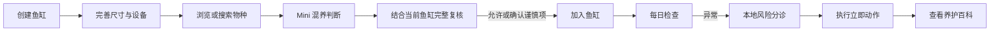

# AquaGuide 产品需求文档（PRD）

## 1. 背景与目标

水族新手面对的困难通常不是“缺少知识”，而是知识分散、结论互相冲突，以及不知道下一步应先做什么。AquaGuide 将鱼缸真实资料、物种知识、确定性混养规则、每日异常巡检和养护百科连接起来，让用户在购买或操作前完成低风险判断。

产品愿景：让新手能用一套看得懂、可追溯、不会被 AI 随意改写的流程管理鱼缸。

### 产品原则

1. 安全结论由本地规则产生，AI 只解释、整理和追问。
2. 一屏一个重点、一个主操作；按钮必须产生可观察结果。
3. 手机和桌面共享业务数据，但拥有独立布局表面。
4. 不把信息不足伪装成安全，也不提供疾病确诊或自动用药。
5. 数据默认保存在当前浏览器，必须明确提示同步与丢失风险。

## 2. 目标用户

| 用户 | 特征 | 核心任务 | 主要障碍 |
| --- | --- | --- | --- |
| 新手缸主 | 第一次或前几次养鱼 | 建缸、选鱼、判断能否混养 | 不懂参数、容易被单一经验误导 |
| 轻度爱好者 | 有 1–3 个鱼缸 | 记录养护、扩充生物、处理异常 | 信息分散、记录断裂 |
| 谨慎购买者 | 购买前做功课 | 收藏物种、比较组合 | 不知道结论是否结合自己的鱼缸 |
| 复盘型用户 | 经历异常或死亡 | 记录原因、查补救步骤 | 缺少结构化观察和后续行动 |

## 3. 核心价值与行为变化

- 购买前：从“看起来喜欢”变为“先结合鱼缸做混养判断”。
- 日常中：从“出问题才搜索”变为“每天用一分钟完成观察”。
- 异常时：从“直接加药”变为“先执行低风险立即动作，再查看百科”。
- 学习上：从收藏散乱内容变为在“我的水族册”集中查看、纪念和追踪成就。

## 4. 功能与优先级

| 模块 | 功能 | 优先级 | 当前状态 | MVP |
| --- | --- | --- | --- | --- |
| 我的鱼缸 | 多鱼缸、尺寸、水体、设备、生物和 3D 展示 | P0 | 已完成，窄桌面待优化 | ✅ |
| 图鉴 | 搜索、筛选、物种详情、种草 | P0 | 已完成，详情动作待闭环 | ✅ |
| 混养判断 | Mini 组合判断、完整鱼缸判断、添加复核 | P0 | 已完成 | ✅ |
| 每日检查 | 结构化观察、本地分诊、同日更新 | P0 | 已完成 | ✅ |
| 养护百科 | 搜索、分类、问题步骤、收藏 | P0 | 已完成，桌面信息结构待优化 | ✅ |
| AI 建缸助手 | 理解目标、最多三问、安全候选方案 | P1 | 已完成 | ✅ |
| 我的水族册 | 种草、养护、生命纪念、勋章 | P1 | 已完成，解释和窄窗待优化 | ✅ |
| 成就勋章 | 8 枚现有数据自动追溯成就 | P1 | 已完成，逻辑说明待优化 | ✅ |
| 3D Demo | 新 3D 动效与材质实验 | P2 | 内部实验，不进正式导航 | ❌ |
| 云同步 | 跨设备备份与恢复 | P2 | 未实施 | ❌ |

## 5. 核心用户旅程

## 6. 成功指标

当前事件统计仅保留会话内汇总，不记录用户自由描述。

| 指标 | 定义 | 首阶段目标 |
| --- | --- | --- |
| 建缸完成率 | 开始创建后完成尺寸、水体与设备的比例 | ≥ 65% |
| 混养判断完成率 | Mini 结果后进入并完成完整判断的比例 | ≥ 45% |
| 安全写入率 | 生物加入前经过统一规则复核的比例 | 100% |
| 每日检查完成率 | 开始检查后保存当日结果的比例 | ≥ 75% |
| 补救到达率 | 异常结果后进入候选养护文章的比例 | ≥ 40% |
| CTA 有效性 | 自动审计中有可观察结果的按钮占比 | 100% |
| AI 安全通过率 | AI 不降级风险、不虚构候选或文章 | 100% |

## 7. 非功能需求

- 兼容：现代 Chromium、Safari；真实手机使用手机布局，平板和桌面使用桌面布局。
- 响应式：桌面宽度变化不能切换成手机壳，但页面内部必须重排且无横向裁切。
- 可访问性：键盘可操作、可见焦点、弹窗焦点陷阱、关闭后恢复来源。
- 性能：3D 离屏或后台暂停；普通图片懒加载；大型模块按路由或组件延迟加载。
- 安全：AI Key 只在 Express/部署函数读取；前端不得包含服务端密钥。
- 隐私：自由描述、问卷答案和 AI 原始回复不进入行为事件。

## 8. P0 验收标准

- Given 用户在桌面将窗口缩至 768px，When 浏览任一核心页，Then 仍为桌面导航且正文没有横向裁切。
- Given 用户从图鉴打开物种详情，When 点击“检查混养”，Then 进入完整混养页并保留物种选择。
- Given 鱼缸缺少尺寸或参数，When 点击详情内精确补充动作，Then 打开对应鱼缸设置面板。
- Given 本地规则判定不建议，When 用户尝试加入，Then 不写入鱼缸并显示阻断原因。
- Given 用户当日重复巡检，When 再次保存，Then 更新同一条当日记录。
- Given AI 未配置、超时或返回非法内容，When 使用 AI 功能，Then 继续展示本地规则结果。

## 9. 不在当前范围

- 疾病确诊、自动用药和替代专业诊疗。
- 积分、排行榜、社交成就或勋章领取机制。
- 自动购买、价格比较或商业推荐排序。
- 未经专项设计的 Supabase 数据迁移。
- 将实验 `/3d-demo` 暴露为正式用户入口。

