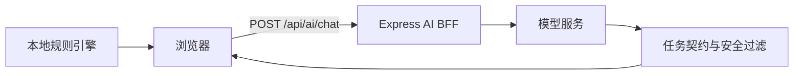

# AquaGuide AI 与 API 说明

> AI 是解释与整理层，不是混养规则、风险判断或疾病诊断的唯一来源。精确类型以 [CONTRACT.md](../../CONTRACT.md) 为准。

## 1. 服务边界

浏览器不直接持有模型密钥。服务端负责密钥、超时、限流、请求格式与统一错误。

## 2. 接口

### `GET /api/health`

用于检查 AI 服务是否运行及是否完成必要配置。健康检查不能替代一次真实任务调用。

### `POST /api/ai/chat`

请求包含任务名和该任务需要的结构化上下文。响应包含结构化结果及统一元数据：

- `source`：结果来源或降级来源。
- `failureReason`：失败或降级原因，可为空。
- `generatedAt`：生成时间。

服务默认每个客户端每分钟最多 10 次请求，默认模型超时为 20 秒；部署环境可通过环境变量调整。

## 3. 现有 AI 任务

| 任务名 | 用户场景 | 确定性输入 | AI 职责 | 失败兜底 |
|---|---|---|---|---|
| `risk_explanation` | 解释已知风险 | 本地风险结论 | 转成易懂说明 | 显示规则原因 |
| `risk_audit` | 复核风险信息 | 规则结果与上下文 | 找遗漏、补问题 | 保持原风险 |
| `recommendation_assist` | 辅助推荐 | 候选物种/文章 | 排序与解释 | 使用本地推荐 |
| `build_tank_copilot` | AI 建缸助手 | 用户目标与鱼缸约束 | 组织可执行方案 | 使用规则模板 |
| `tank_daily_check_interpretation` | 每日检查 | 鱼缸快照、答案、确定性结果、候选文章 | 理解自然语言、整理关联、补充问题 | 展示本地分诊与百科步骤 |

`build_tank_copilot` 是内部兼容任务名；用户界面统一称“AI 建缸助手”。

公开页面当前保留三个 AI 使用场景：用户主动进入“AI 建缸助手”、每日检查发现异常或包含自由描述时的受控解读，以及用户确认物种后的状态描述解析。`risk_explanation`、`risk_audit` 与 `recommendation_assist` 继续保留接口兼容，但不得在今日行动、风险弹窗或单物种详情新增公开入口。

### 3.1 物种识别与动态状态判断

- 视觉模型使用独立 `VISION_*` 配置，上传图片只在内存去 EXIF、缩放并推理，不写 Storage。
- 视觉模型只给候选；学名、名称和别名映射由本地物种库完成，模糊结果不得自动确认。
- `species_symptom_interpretation` 只提取受控观察代码。本地规则选择红旗与信息增益最高的问题，并生成紧急等级、动作和原因顺序。
- AI 返回的规则外观察、疾病、用药、文章 ID 或较低紧急等级不会进入最终结果。
- 识别未命中只聚合保存 SHA-256 指纹、模型与候选标签，不保存图片、用户、鱼缸或症状文本。

## 4. 每日检查契约

输入必须包含：当前鱼缸快照、结构化答案、可选自由描述、本地确定性结果、允许推荐的候选文章摘要。

输出包含：摘要、优先级、推理要点、推荐文章 ID、补充问题和免责声明。

强制约束：

1. AI 优先级不得低于本地规则等级。
2. 推荐文章 ID 必须存在于候选列表；其他 ID 直接丢弃。
3. 不输出自动用药、疾病确诊或取代专业检测的表述。
4. 不把模型原始回复写入本地记录。
5. 异常或有自由描述时才调用 AI；正常结构化检查无需调用。

## 5. 错误与降级

以下情况必须返回可识别的失败原因，并继续提供安全的本地结果：未配置密钥、网络失败、超时、非 2xx 响应、非法 JSON、结构不匹配、AI 降低风险、虚构文章、空回复。

界面不得只显示“AI 失败”。应说明“已使用本地规则完成判断”，异常巡检可由用户重新触发受控解读，但不能阻断本地结论或补救文章入口。

## 6. 隐私与可观测性

- 自由描述不进入行为事件统计。
- 事件只记录动作名、状态和功能入口，不持久化用户描述。
- 日志不得记录模型密钥、完整自由文本或可恢复的个人信息。
- 当前会话事件默认仅保留在会话内。

## 7. AI 质量评估

| 维度 | 通过标准 |
|---|---|
| 安全一致性 | 0 次风险降级、0 个白名单外文章 |
| 契约有效性 | 输出可解析并满足必填字段 |
| 任务完成 | 用户在失败时仍能获得本地结论和下一步 |
| 可解释性 | 结论与提供的鱼缸事实相符，不引入未知事实 |
| 稳定性 | 超时、非法回复与未配置均触发明确降级 |
| 视觉候选 | 清晰/模糊/多主体/非水族图片均需要用户确认；库外结果不自动命中 |
| 追问策略 | 红旗优先、问题不重复、最多三问；中英文代码与顺序一致 |
