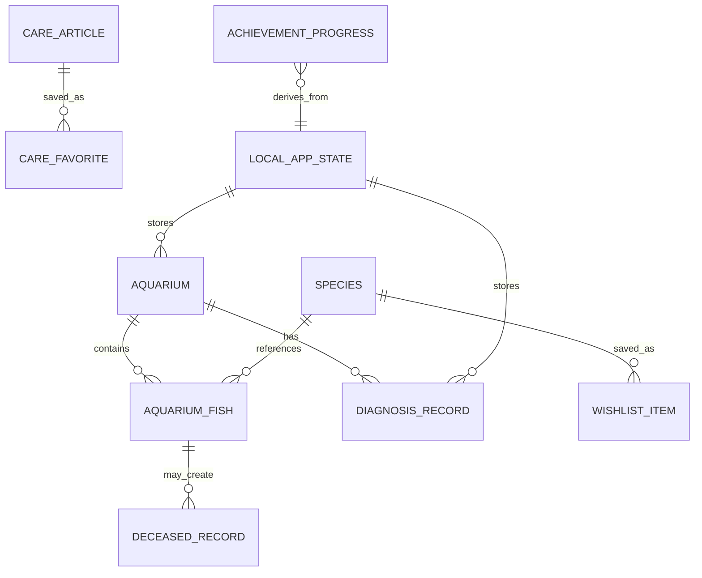
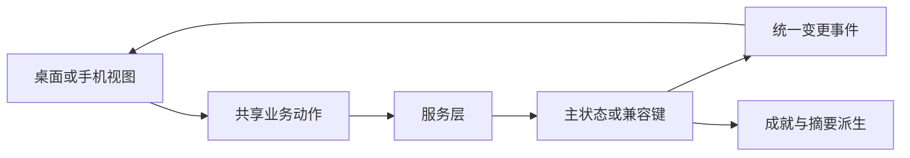

# AquaGuide 数据模型

> 当前产品以浏览器本地状态为主，不存在业务数据库表。本文件描述产品实体与存储事实；代码字段的精确定义以 [CONTRACT.md](../../CONTRACT.md) 和 `src/types.ts` 为准。

## 1. 实体关系

## 2. 核心实体

| 实体 | 主要内容 | 来源 | 写入方式 |
|---|---|---|---|
| `Fish` / 物种 | 名称、图片、饲养与混养资料 | 静态物种服务 | 构建时维护 |
| `Aquarium` / 鱼缸 | 尺寸、水体、温度、参数、设备、生物 | 应用主状态 | 鱼缸设置与添加流程 |
| `AquariumFish` | 物种引用、数量、加入日期等 | 鱼缸 | 通过鱼缸动作修改 |
| `DiagnosisRecord` | 问题类型、答案、结论、行动与观察项 | 每日检查/诊断 | 同缸同日巡检更新 |
| 种草收藏 | 物种 ID 集合 | 收藏服务 | 收藏切换 |
| 养护收藏 | 文章 ID 集合 | 收藏服务 | 收藏切换 |
| `DeceasedRecord` | 生物、日期、原因与复盘 | 生命纪念 | 确认后保存 |
| `AchievementProgress` | 当前值、目标、解锁与下一步 | 成就计算服务 | 只读派生，不单独保存 |

## 3. 主状态与兼容键

| 本地键 | 作用 | 地位 |
|---|---|---|
| `aquarium_app_state_v1` | 鱼缸、当前鱼缸与诊断记录等主状态 | 当前主来源 |
| `aquariums` | 旧鱼缸数据 | 兼容读取 |
| `wishlistFishIds` | 种草物种 ID | 现有收藏键，暂不迁移 |
| `aqua_care_favorites` | 养护文章收藏 | 现有收藏键，暂不迁移 |
| `aquarium_diagnosis_records` | 旧诊断记录 | 兼容读取 |
| `deceasedRecords` | 死亡记录 | 现有记录键，暂不迁移 |
| `aquapediaDiscoveryDeck` | 图鉴发现卡组状态 | 辅助状态 |
| `aqua_care_reminders` | 养护提醒 | 旧/辅助功能状态 |
| `aqua_care_completed_operations` | 已完成养护操作 | 辅助状态 |
| `aqua_care_saved_checklists` | 保存的检查清单 | 辅助状态 |

不新增新的 localStorage 集合来保存每日检查、收藏或成就。成就由现有鱼缸、收藏、巡检、换水和死亡记录实时计算。

## 4. 关键业务约束

- Mini 混养作用域为 `species_only`，只读所选物种。
- 完整混养作用域为 `tank`，读取当前鱼缸环境。
- 同一鱼缸同一自然日最多一条 `problemType: "巡检"` 记录；重复提交更新该条记录。
- AI 原始回复不写入巡检记录，只保存经过本地规则约束后的结果。
- 收藏和纪念写入成功后派发统一应用变更事件，使页面与成就即时重算。
- “和谐共生”只接受统一规则引擎的 `compatible`；谨慎与资料不足不能解锁。

## 5. 数据流

目前仍有页面直接写 localStorage 与服务层写入并存，这是待治理问题，不是推荐架构。

## 6. 同步与恢复限制

- 未登录场景的数据主要保存在当前浏览器，清理站点数据会丢失。
- 当前没有跨设备同步、云端备份或冲突合并。
- Supabase 当前主要用于可选身份能力，不代表业务数据已经云端化。
- 云端同步需要单独完成数据库、权限、迁移、恢复和隐私设计；在方案确认前不得直接迁移。

