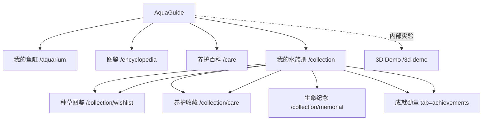

# AquaGuide 信息架构

> 状态：当前事实基线。路由以 `src/App.tsx` 为准，实验页面不计入正式导航。

## 1. 一级结构

产品只包含四个正式核心模块。概念稿中出现过的“设置、数据统计、提醒中心”没有独立正式路由，不属于当前产品架构；养护计划作为“我的鱼缸”内的紧凑区块展示，不扩展为新的导航中心。

## 2. 导航规则

| 设备布局 | 主导航 | 辅助入口 | 规则 |
|---|---|---|---|
| 桌面、平板 | 左侧栏：我的鱼缸、图鉴、养护百科 | 我的水族册 | 侧栏只由用户手动收起；窗口缩窄不切成手机底栏 |
| 真实手机 | 底部栏：我的鱼缸、图鉴、养护百科、我的水族册 | 页面内任务入口 | 使用手机专属排版与面板 |

设备布局在应用启动时按设备能力确定。桌面浏览器从 1440px 缩到 600px 仍使用桌面结构；页面内容根据可用容器宽度重排。平板默认使用桌面结构。

## 3. 正式路由

| 路由 | 页面职责 | 主要数据 | 状态 |
|---|---|---|---|
| `/aquarium` | 鱼缸概览、维护记录、每日检查、添加生物 | 鱼缸、缸内生物、巡检记录 | 正式 |
| `/encyclopedia` | 查物种、种草、Mini 混养 | 物种库、收藏、混养规则 | 正式 |
| `/care` | 搜索养护知识、问题补救与收藏 | 养护文章、当前鱼缸 | 正式 |
| `/collection` | 水族册模块首页 | 四类数量与用途 | 正式 |
| `/collection/wishlist` | 种草图鉴 | 现有种草收藏 | 正式 |
| `/collection/care` | 养护收藏 | 现有养护收藏 | 正式 |
| `/collection/memorial` | 生命纪念 | 死亡记录 | 正式 |
| `/collection/achievements` | 成就进度 | 现有数据的派生结果 | 正式 |
| `/login` | 可选登录入口 | Supabase Auth | 辅助 |
| `/3d-demo` | 3D 独立验证页 | 3D 场景与物种素材 | 内部实验，不进入正式导航与核心验收 |

兼容路由：旧 `/collection?tab=...`、`/wishlist` 与 `/care-favorites` 重定向到对应独立地址。兼容路由不应再作为新入口使用。

## 4. 页面内层级

| 页面 | 首屏重点 | 次级内容 | 进入详情的方式 |
|---|---|---|---|
| 我的鱼缸 | 当前状态与今天要做的事 | 生物、维护记录、3D 展示 | 桌面右侧详情面板；手机底部全高面板 |
| 图鉴 | 搜索、筛选和物种结果 | Mini 混养选择栏 | 物种详情面板 |
| 养护百科 | 问题搜索和当前鱼缸建议 | 主题分类与文章结果 | 养护文章详情面板 |
| 我的水族册 | 四类数量和当前页签 | 收藏、纪念、成就卡片 | 保持水族册上下文打开详情 |

## 5. 信息边界

- 图鉴负责“认识与初筛”，不直接写入鱼缸。
- Mini 混养只判断所选物种之间的关系；完整混养才结合鱼缸容量、参数与设备。
- 每日检查负责风险分诊和补救引导，不做疾病确诊或自动用药。
- 我的水族册只聚合已有内容，不复制收藏或纪念数据。
- 成就是只读派生结果，不需要领取，不产生积分或排行。

## 6. 详情与任务表面

| 内容 | 表面 | 关闭后的返回位置 |
|---|---|---|
| 物种、养护文章、死亡记录详情 | 桌面中央弹窗 / 手机底部全高面板 | 原列表、原页签、原滚动位置与触发卡片 |
| 每日检查、添加生物、鱼缸设置、AI 建缸助手 | 沉浸式任务流程 | 来源页面，并显示完成或失败状态 |
| 删除、清空、确认死亡记录 | 居中确认弹窗 | 原表面与触发控件 |
| 规则依据、次要说明 | 原位展开 | 不离开当前上下文 |

## 7. 事实来源

- 路由与布局壳：`src/App.tsx`
- 页面：`src/pages/`
- 导航：`src/components/DesktopSidebar.tsx`、`src/components/MobileBottomNav.tsx`
- 水族册模块首页：`src/pages/CollectionHub.tsx`
- 水族册具体模块：`src/pages/Collection.tsx`
- 代码契约：[CONTRACT.md](../../CONTRACT.md)
