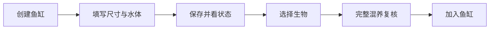
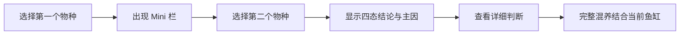
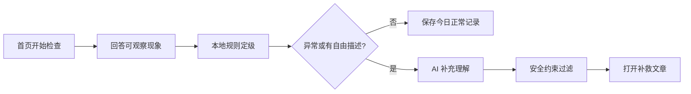
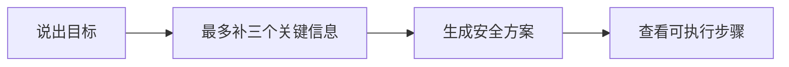

# AquaGuide 交互说明

> 本文继承工作区 [interaction-rules.md](../../../interaction-rules.md) 的全部 P0 规则。当前实现与本文不一致之处，应登记到[产品卡点与路线图](../04-planning/PRODUCT_GAPS_AND_ROADMAP.md)，不能用文档掩盖。

## 1. 设计原则

1. 一屏一个重点，一个主操作。
2. 用户点击后必须看到页面变化、状态变化、成功/失败反馈或明确跳转。
3. 信息分层：先结论，再原因，最后展开依据。
4. 桌面与手机功能一致，但使用各自的布局和交互表面。
5. AI 只补充解释；混养结论和风险等级由确定性规则守底。

## 2. 四类交互表面

| 表面 | 用途 | 结构 | 关闭方式 |
|---|---|---|---|
| 原位展开 | 规则依据、次要说明、卡片补充信息 | 位于触发内容下方 | 再次点击或“收起” |
| 详情面板 | 物种、文章、死亡记录 | 固定标题区、唯一滚动区、底部操作区 | 返回/关闭，恢复来源上下文 |
| 任务流程 | 每日检查、添加生物、设置鱼缸、AI 建缸助手 | 步骤、当前输入、结果 | 完成后返回；有未保存内容时确认离开 |
| 确认弹窗 | 删除、清空、记录死亡等破坏性操作 | 对象、影响、取消、危险操作 | 取消或完成；焦点回到触发控件 |

桌面详情使用页面中央弹窗，最大宽度约 900px、最大高度 88dvh；手机详情从底部进入并可占满可用高度。动画时长为 160–220ms，只表达打开、关闭、切换和完成状态。

## 3. 按钮动作契约

每个按钮必须登记为以下一种动作，并产生可观察结果。

| 类型 | 结果 | 示例 |
|---|---|---|
| `route` | URL 与页面内容改变 | 查看详细判断 |
| `view` | 打开或关闭详情表面 | 打开物种详情 |
| `mutation` | 数据变化并有成功/失败反馈 | 加入种草、保存鱼缸 |
| `dialog` | 打开确认或任务流程 | 记录死亡 |
| `section` | 当前页定位或原位展开 | 展开规则依据 |
| `external` | 打开标明来源的外部内容 | 官方参考资料 |

以下按钮必须删除或修复：空处理函数、只写日志、只设置用户不可见状态、与整卡点击结果完全相同的重复 CTA、没有定位结果的“去完善”、以原生 `alert` 代替反馈的操作。

异步写操作必须立即禁用并显示进行中状态；成功显示 2–3 秒反馈，失败显示可关闭错误并保留用户输入。搜索结果和列表初始加载使用结构匹配的骨架；空列表提供解释和一个有效下一步。

## 4. 布局与响应规则

| 场景 | 导航结构 | 内容规则 |
|---|---|---|
| 宽桌面 | 桌面侧栏 | 使用多列布局，但限制正文行宽 |
| 窄桌面 | 仍为桌面侧栏 | 按容器降列、折行；禁止横向裁切和手机底栏 |
| 平板 | 桌面结构 | 可收窄侧栏，触控目标不小于 44px |
| 真实手机 | 手机底栏 | 单列、吸顶工具栏、底部安全区 |

页面内部使用容器宽度决定列数，不使用视口断点把桌面页面替换成手机页面。图片必须限制在容器内，卡片使用可收缩网格列，长标签允许换行或省略并提供完整可访问名称。

## 5. 单个物种详情

### 5.1 首屏信息顺序

1. 物种名称、图片、基础分类。
2. 对当前鱼缸的结论；没有鱼缸时只显示“尚未选择鱼缸”。
3. 最关键的三条原因。
4. 唯一主操作和一个不同结果的次操作。

详情页签固定为“适配结论 / 混养关系 / 养护要点”。不能在没有当前鱼缸时把温度、pH、尺寸、过滤等六项都表现为失败。

### 5.2 操作闭环

| 操作 | 目标行为 |
|---|---|
| 检查混养 | 直接进入完整混养页，并保留当前物种；不只修改隐藏选择状态 |
| 补充 pH / 设置温度 / 完善尺寸 / 配置设备 | 进入当前鱼缸设置中的对应区域，定位并高亮目标字段 |
| 加入种草 | 原位切换收藏状态，按钮文字和数量即时更新，失败时回滚 |
| 记录死亡 | 移入“更多操作”，先填写日期与原因，再确认保存 |
| 查看当前鱼缸 | 仅在来源不是鱼缸且该操作确有导航价值时显示 |

删除没有真实跳转的“去完善环境”、重复的关闭按钮，以及仅显示提示但不执行目标动作的 CTA。

### 5.3 返回上下文

打开详情前保存来源路由、筛选条件、分页、滚动容器位置和触发元素。关闭后先恢复页面状态，再滚动到原卡片并将焦点还给触发元素。目标卡片消失时，聚焦列表标题并显示“内容已更新”。

## 6. 核心路径

### 6.1 创建鱼缸与添加生物

添加生物最多三步：选生物、看复核、确认加入。选择和结果在前进、后退时不能丢失。

### 6.2 图鉴与混养

Mini 不读取鱼缸环境，也不能直接加入鱼缸。四态为 `compatible`、`caution`、`not_recommended`、`insufficient_data`。

### 6.3 每日鱼缸检查

同一鱼缸同一自然日重复检查更新当天记录。AI 不可用时仍显示本地结论与补救步骤；AI 不能降低本地风险，也不能推荐白名单外文章。

### 6.4 收藏、纪念与水族册

收藏或死亡记录保存后，统一变更事件使水族册数量即时更新。用户从水族册打开详情，关闭后仍停留在原页签和原卡片，不跳回图鉴、养护或鱼缸主页。

### 6.5 AI 建缸助手

用户界面统一使用“AI 建缸助手”，不显示英文 Copilot。AI 结果必须区分确定事实、规则结论和建议；失败时保留用户输入并提供重试或返回规则方案。

### 6.6 成就勋章

成就页首屏必须解释：“勋章根据已有记录自动解锁，无需领取。”每张锁定卡只显示当前进度、目标和一个下一步，例如“再巡检 2 天”。解锁态显示日期或完成说明；不使用死亡数量作为奖励。

## 7. 表单、错误与无障碍

- 必填项在标签中标明；提交时统一验证，并聚焦第一个错误字段。
- 有未保存修改时，路由离开与刷新都要确认。
- 所有图标按钮有可访问名称；所有图片有描述性 `alt`。
- 详情面板和弹窗打开后限制焦点范围，支持 Esc 关闭；确认弹窗默认聚焦安全操作。
- 正文与背景、按钮文字与底色满足 WCAG AA；不能只用颜色表达风险。
- 任务失败时说明发生了什么、数据是否保存、下一步可以做什么。

## 8. 页面验收清单

- 点击任何可见按钮，2 秒内出现可观察结果或进行中状态。
- 桌面缩到 600px 不出现手机底栏、横向裁切或重叠操作区。
- 详情关闭后恢复原卡片、焦点与滚动位置。
- 删除、清空、记录死亡均经过有对象名称的确认流程。
- 无鱼缸、无收藏、无记录、无搜索结果均有专用空状态。
- AI 超时、未配置、非法回复、越权推荐时均安全降级。
