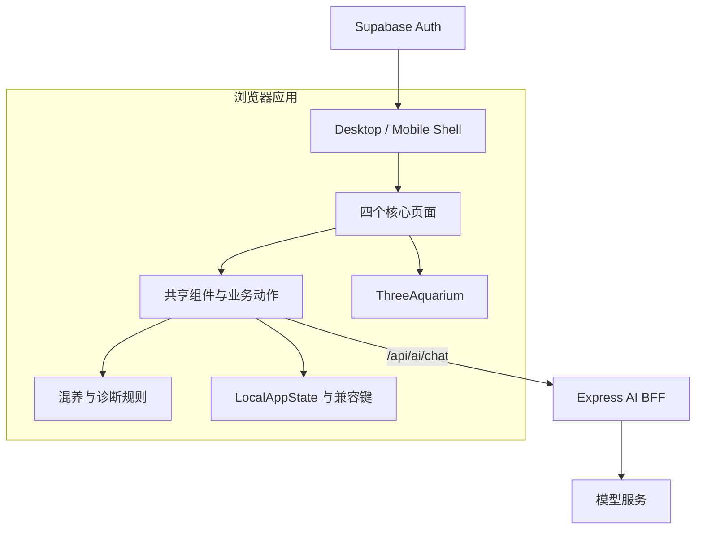

# AquaGuide 技术架构

## 1. 技术栈

| 层 | 技术 | 职责 |
|---|---|---|
| Web | React 19、TypeScript、React Router | 页面、交互与客户端路由 |
| 构建 | Vite 6、Tailwind CSS 4 | 开发服务器、构建与样式 |
| 3D | Three.js、React Three Fiber、Drei | 鱼缸场景与生物贴图 |
| API | Express | AI BFF、健康检查、限流与超时 |
| AI | DeepSeek 兼容接口 | 解释、整理与辅助推荐 |
| 身份 | Supabase Auth（可选） | 登录能力；业务数据仍主要在本地 |
| 验证 | TypeScript、tsx 脚本、Playwright | 类型、规则契约与核心路径 |

## 2. 系统结构

## 3. 前端边界

- `src/pages/`：路由级页面与任务编排。
- `src/components/`：跨页面表面、导航、3D 与复用 UI。
- `src/services/`：本地状态、收藏、成就、混养和业务写入。
- `src/lib/`：AI 客户端、Supabase 客户端与通用能力。
- `src/data/`：物种与养护静态资料。
- `src/types/` 与 `src/types.ts`：共享数据契约。

桌面与手机视图可以独立排版，但不得各自维护一份业务数据。页面应调用共享动作，再由服务层统一写入并派发变更事件。

## 4. 核心数据流

### 混养

物种选择进入统一规则引擎。Mini 使用 `species_only`，完整计算使用 `tank`。两者必须返回同一四态结构，避免不同入口产生相反结论。

### 每日检查

结构化答案和鱼缸快照先进入本地诊断规则。仅在有异常或自由描述时请求 AI；返回结果经过风险等级和文章白名单过滤后才展示与保存。

### 水族册与成就

水族册聚合现有收藏和死亡记录。成就计算服务读取现有状态得到进度，不写入独立业务结论。

### 3D 素材

普通卡片与 3D 贴图应共同通过物种展示图解析函数获取 URL。贴图 URL 变化时必须释放旧纹理并重新加载；组件卸载时清理资源。`/3d-demo` 仅用于实验验证。

## 5. AI BFF

浏览器通过 `/api/ai/chat` 调用 Express。密钥只存在服务端环境；服务端负责任务白名单、每客户端每分钟 10 次限流、默认 20 秒超时、结构解析和统一错误。详细规则见 [AI_AND_API_SPEC.md](../02-design/AI_AND_API_SPEC.md)。

## 6. 当前技术风险

- `species.service` 与 `ThreeAquarium` 体积较大，影响维护和潜在拆包收益。
- 本地数据存在页面直写与服务写入并存，容易造成即时刷新不一致。
- 3D 首次加载、低端设备帧率、纹理缓存与资源释放需要专项验证。
- 业务数据缺少跨设备同步和恢复机制。
- 实验组件和已禁用旧组件需要与正式路径持续隔离。

以上风险按[产品卡点与路线图](../04-planning/PRODUCT_GAPS_AND_ROADMAP.md)治理。核心交互稳定前，不同时进行大型 3D 或物种数据重构。

## 7. 部署边界

- Web 静态资源由 Vite 构建。
- Express AI 服务需要独立运行或与部署平台的服务能力结合。
- 生产环境必须配置模型密钥，并限制允许的前端来源。
- 未确认数据库方案前，不把浏览器主状态迁移到 Supabase。

