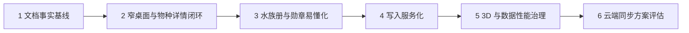

# AquaGuide 产品卡点与路线图

> 记录日期：2026-07-14。状态基于当前代码与浏览器行为，不以旧概念稿为依据。

## 1. 优先级定义

- P0：阻断核心任务、产生错误写入或让用户无法判断点击结果。
- P1：功能可完成，但理解成本高、两端不一致或容易误操作。
- P2：稳定性、性能、维护性和长期数据能力。

## 2. P0 卡点

| ID | 现象与用户影响 | 代码/行为依据 | 目标行为 | 验收标准 | 状态 |
|---|---|---|---|---|---|
| P0-01 | 桌面窗口缩窄后卡片溢出、内容裁切，核心操作可能不可见 | 鱼缸按三/二/一列、图鉴和水族册按内容宽度降列；600–1440px 实测无横向溢出 | 保持桌面壳，内容按容器降列 | 1440→600px 无手机底栏、横向裁切、重叠按钮 | 已完成 |
| P0-02 | 物种详情部分按钮只改变隐藏状态或显示提示，用户以为点击无效 | 当前主详情已改为真实混养、设置、收藏与纪念动作；旧禁用详情仍待清理 | 所有 CTA 到达对应页面、面板或状态 | 按钮动作审计通过；每次点击 2 秒内有结果 | 部分完成 |
| P0-03 | “去完善环境”不能直接进入所缺参数，路径冗长 | 温度、水体、尺寸和设备已进入对应设置并高亮；当前数据契约没有 pH/硬度字段 | 进入鱼缸设置并定位到已有字段；pH 需先单独确认数据契约 | 目标区域可见并高亮；不展示无法保存的伪 pH 按钮 | 部分完成 |
| P0-04 | 无鱼缸时六项适配指标看起来全部失败，造成错误焦虑 | 主详情已改为单一“尚未选择鱼缸”状态 | 统一显示“尚未选择鱼缸” | 无鱼缸时不出现六项失败状态，只给设置鱼缸路径 | 已完成 |
| P0-05 | 图鉴和鱼缸入口的“混养计算”动作不同，选择可能只存在隐藏状态 | 两端主详情均先保存所选物种，再进入完整混养 | 统一进入完整计算并携带当前物种 | URL/流程可见、选择保留、结论一致 | 已完成 |
| P0-06 | 部分死亡入口直接写入，缺少原因填写与确认，容易误记 | 主详情已使用日期+原因确认表单与纪念服务；旧禁用详情仍待移除 | 更多操作 → 填写 → 确认 → 保存 | 未确认不写入；保存后纪念页和成就即时更新 | 部分完成 |
| P0-07 | 页面直写 localStorage 与服务写入并存，可能造成页面不同步 | 鱼缸、巡检、收藏、死亡、养护提醒/操作/清单已进入服务；仅图鉴筛选、推荐牌堆和未路由 AI 聊天保留页面级 UI 存储 | 业务写入收口服务层并派发统一事件 | 业务状态无页面直写；跨页面即时刷新 | 部分完成 |

## 3. P1 卡点

| ID | 现象与影响 | 目标行为 | 验收标准 | 状态 |
|---|---|---|---|---|
| P1-01 | 用户不理解勋章是否需要领取、如何解锁 | 首屏解释自动追溯；卡片显示当前/目标/唯一下一步 | 8 枚勋章均能回答“已完成什么、还差什么” | 已完成 |
| P1-02 | 水族册在窄桌面列数固定，卡片拥挤 | 依据内容容器降列 | 各页签 600–1440px 无溢出，卡片信息顺序稳定 | 已完成 |
| P1-03 | 锁定、进行中、已解锁状态视觉接近 | 颜色、图标、文字三重区分 | 三态均有独立文字与图标，不只依赖颜色 | 已完成 |
| P1-04 | 桌面与手机功能目标一致，但部分页面仍混用视口断点 | 数据与动作共享，视图独立 | 功能对照表逐项一致，缩放不切换设备壳 | 部分完成 |
| P1-05 | 旧专项文档存在旧命名、旧入口和失效结论 | 历史报告标记归档，当前文档唯一入口 | 新成员从 `docs/README.md` 不会读到失效架构 | 本轮处理 |
| P1-06 | 手机种草与养护收藏入口分散，用户不知道收藏去了哪里 | 正式入口统一进入水族册对应页签 | 不再打开旧收藏弹窗或鱼缸原位列表 | 已完成 |
| P1-07 | 手机图鉴底部分页折叠，边界跳转路径长 | 首页/上一组/组数/下一组/尾页保持单行 | 320–430px 无折叠、横向滚动，边界状态正确 | 已完成 |
| P1-08 | 手机养护推荐自动移动且露出相邻内容，底部留白重复 | 推荐只手动切换并完整显示一张；安全区只由应用壳提供 | 等待不换卡、无横向溢出、末卡下方约 16px | 已完成 |
| P1-09 | “设置提醒”只有本地文字，用户无法查看到期状态 | 升级为鱼缸页内的应用内养护计划 | 支持明确日期、到期状态、完成、改期、确认删除和旧数据迁移 | 已完成 |

## 4. P2 卡点

| ID | 现象与影响 | 目标 | 验收标准 | 状态 |
|---|---|---|---|---|
| P2-01 | `species.service` 与 `ThreeAquarium` 代码块较大 | 核心稳定后按数据、纹理和交互边界拆分 | 构建体积与运行性能基线改善，行为无回归 | 延后 |
| P2-02 | 3D 首载、低端设备帧率和资源释放未形成专项基线 | 已记录块体积、暂停、限帧与释放事实；真实低端设备曲线待测 | 纹理 URL 更新、卸载释放、后台暂停均通过 | 部分完成 |
| P2-03 | 数据主要保存在浏览器，缺少跨端同步与恢复 | 已完成云端实体、RLS、迁移、冲突、恢复与隐私方案评估 | 正式数据契约获用户确认后才可实施 | 方案已完成 / 实施延后 |
| P2-04 | 已禁用旧组件、未路由页面和实验代码容易回流 | 明确隔离或删除策略 | 正式构建与导航不暴露实验功能 | 待治理 |
| P2-05 | `/3d-demo` 尚未产品化 | 仅作为内部实验 | 不进入正式导航、核心事件和发布验收 | 实验中 |
| P2-06 | 批量物种图片存在浅色低对比、贴边或主体碎片化 | 已审计 486 张并生成 18 张中优先级返工队列；不自动覆盖原图 | 逐张复核返工队列，返工后重新执行透明边缘、体积和 2D/3D URL 检查 | 审计完成 / 返工待执行 |

## 5. 迭代顺序

### 阶段 1：事实基线

完成本套文档、历史报告归档标记、路由与术语核对。只改文档，不改产品代码。

### 阶段 2：核心交互 P0

先修复窄桌面和物种详情动作。建立回归测试后再修改，以 600px 桌面、物种详情按钮审计和跨入口混养一致为退出条件。

### 阶段 3：水族册与成就

让页签按容器响应，重做成就三态与说明。成就逻辑不增加积分、排行、手动领取或独立存储。

### 阶段 4：数据写入收口

将收藏、死亡记录和鱼缸数据的页面直写迁移到现有服务层。在不改变存储键的前提下统一反馈和变更事件。

### 阶段 5：性能专项

先建立 3D 性能、资源释放与构建体积基线，再决定拆包边界。不与布局重构同时进行。

### 阶段 6：云端同步评估

只输出方案与影响评估。未完成数据库契约、RLS、迁移、恢复和用户确认前，不实施 Supabase 业务数据迁移。

## 6. 共同完成定义

每阶段都必须：更新状态文档；运行对应自动测试；真实浏览器走查；确认桌面与手机结果一致；记录未处理边界；形成可独立回滚的提交。
