# AquaGuide 功能框架梳理与系统不足分析报告

> **历史审计（部分结论已失效）**：本文保留用于追溯早期判断，不再作为当前产品事实依据。天气联动、客户端暴露 AI Key、旧弹窗与旧收藏结构等描述已与现状不符。请以[当前产品文档索引](./README.md)、[当前产品状态](./01-definition/CURRENT_PRODUCT_STATUS.md)和代码为准。

本报告对 AquaGuide 产品的功能架构进行了系统性梳理，并站在资深系统架构师与产品经理的角度，指出了该系统当前在技术架构、用户体验及安全可靠性上的关键不足。

---

## 一、 产品功能框架图 (Product Functional Framework)

AquaGuide 是一个面向水族爱好者的全功能数字化养护与决策支持工作台。其核心功能模块可以划分为以下 7 个维度：

```mermaid
graph TD
    App[AquaGuide 核心系统] --> M1[1. 鱼缸智能管理]
    App --> M2[2. 生物百科与检索]
    App --> M3[3. 混养风险计算器]
    App --> M4[4. 日常养护与任务]
    App --> M5[5. AI 智能问诊与问答]
    App --> M6[6. 气象联动预警]
    App --> M7[7. 数据底层与同步]

    M1 --> M1_1["3D 鱼缸可视化 (Three.js)"]
    M1 --> M1_2["物理配置管理 (尺寸/材质/过滤/加热)"]
    M1 --> M1_3["缸内生物承载力评估 (Bioload)"]
    
    M2 --> M2_1["多维筛选 (水温/pH/体型/性格/难易)"]
    M2 --> M2_2["种草清单 (收藏夹)"]
    M2 --> M2_3["每日发现 (卡牌式随机生物科普)"]

    M3 --> M3_1["温度/pH 重叠区间分析"]
    M3 --> M3_2["捕食/领地竞争/性格冲突检测"]
    M3 --> M3_3["生物密度与水体容量校验"]

    M4 --> M4_1["动态养护日程生成 (换水/洗滤棉/投喂)"]
    M4 --> M4_2["逝去生物建档 (Deceased Log)"]
    M4 --> M4_3["设备状态日历维护"]

    M5 --> M5_1["分步式交互问诊助手 (诊断树规则引擎)"]
    M5 --> M5_2["基于 DeepSeek 的 AI 养护顾问问答"]

    M6 --> M6_1["本地天气 API 实时同步"]
    M6 --> M6_2["寒潮/高温天水温预警与维护指引"]

    M7 --> M7_1["Local Storage 状态管理"]
    M7 --> M7_2["数据备份、导入与导出 (.json)"]
```

---

## 二、 核心功能模块详解

### 1. 鱼缸智能管理 (Aquarium Management)
- **3D 模拟仿真**：使用 Three.js 异步加载 [ThreeAquarium](../src/components/ThreeAquarium.tsx)，动态渲染用户当前选购的鱼类、水草、底砂及硬景空间关系。
- **建缸指南与模板**：内置了“新手阴性草缸”、“灯鱼草缸”、“三湖慈鲷缸”等标准成熟模版，能够根据用户输入的缸体尺寸，自动匹配设备配置与底砂水草配比。
- **水体容量计算**：基于尺寸（长、宽、高）和安全系数（通常为 85% 水体高度）计算净水体积，计算出最大建议生物承载量。

### 2. 生物与养护百科 (Encyclopedia & Care Encyclopedia)
- **多维度检索图鉴**：不仅支持搜索关键词，还支持对生活类型（淡水鱼、海水鱼、水草等）、水温频段、酸碱度（pH）、成鱼体型、攻击性、混养模式、饲养难度进行精准过滤。
- **浅色低对比度保护**：前端在渲染浅色/透明生物（白金鱼、水母等）时，自动识别并添加微弱的 `bg-emerald-950/[0.05]` 遮罩，确保主体细节在白底 UI 上可见。
- **每日发现卡片**：使用随机游走式推荐算法，限制每日最多推送 5 种新生物（`DISCOVERY_DAILY_LIMIT`），降低用户认知负荷，提升交互粘性。

### 3. 混养风险计算引擎 (Compatibility Engine)
- **参数交集验证**：实时遍历混养列表中的所有生物，比对各生物的温度阈值与 pH 范围，若无重叠交集则发出强预警。
- **生态阶层与掠食冲突**：根据体型等级（小型、中型、大型）与性格（温和、领地意识、凶猛）判定是否存在大鱼吃小鱼（如天使鱼配黑壳虾）、性格霸凌（如斗鱼、慈鲷配温和群游鱼）等潜在冲突。
- **动态修正建议**：给出包含“增加躲避屋”、“调整温区”、“单养建议”在内的自动修复建议。

### 4. 日常维护日历与任务生成 (Maintenance & Tasks)
- **自适应任务**：根据鱼缸的水体容量、水草密度、设备规格，动态计算水质衰减周期，在日历中排程换水（如大缸 7-10 天，小缸 5 天）、清理滤棉、补充肥料等任务。
- **死亡日志纪录**：提供死鱼登记功能，追踪生物的存活周期，为诊断水质和传染病提供历史追踪线索。

### 5. 气象联动预警 (Weather Integration)
- 接入本地天气服务，若室外气温骤降（寒潮）或骤升（暴晒），主动发出强预警，提示用户检查加热棒、准备冷水机或减少喂食，将大自然天气对室内水体生态的影响降到最低。

---

## 三、 当前系统架构的潜在不足与改进建议

尽管产品功能设计非常新颖且体验优良，但在底层代码和系统设计上存在几个直接影响商业化、稳定性与性能的**致命瓶颈**：

### 1. 数据本地存储的“单点故障” (LocalStorage Dependency)
- **不足**：用户的所有鱼缸数据、日常日程、收藏夹及生物数量完全依赖浏览器的 LocalStorage 存储。
  - 极易因用户误清空浏览器缓存、隐私模式（Incognito）或卸载浏览器而导致数据彻底丢失。
  - 缺乏多端同步：用户在电脑上编辑了 3D 鱼缸，无法在手机上实时同步查看。
- **建议**：建议引入基于 Supabase 或 GraphQL 的轻量化后端同步服务，只在本地保留离线缓存（IndexedDB），实现云端多端同步。

### 2. 混养计算与诊断引擎“规则硬编码” (Hardcoded Heuristic Rules)
- **不足**：目前的兼容性校验（`tankCompatibilityEngine`）与问诊诊断树规则完全是在前端通过正则表达式、if-else 或静态 JSON 树硬编码实现的（例如判断是否是白金鱼、水草的正则）。
  - 当生物种类从 480 种扩展到数千种时，代码量将爆炸式增长，且难以热更新（必须发布新版本前端包）。
- **建议**：将诊断逻辑和混养风险判定规则转化为结构化的 JSON 规则定义，通过 API 从后端拉取，由前端通用的规则解析执行器（Rule Engine）动态解释执行。

### 3. 海量静态数据包带来的性能压力 (Huge Synchronous Data Pack)
- **不足**：整个生物数据库 [fishData.ts](../src/data/fishData.ts) 体积较大，是一个巨型的 TypeScript 静态数组。
  - 在首次加载页面时，会阻塞主线程，影响 First Contentful Paint (FCP)。
  - 在进行图鉴筛选或输入搜索时，前端在大列表上同步执行多条件过滤和 `useMemo` 计算，在低端移动设备上会出现打字卡顿或渲染抖动。
- **建议**：将海量数据包进行分片（Lazy Loading / Code Splitting），或者直接存入前端本地数据库（如 IndexedDB / RxDB），使用 Web Workers 进行多线程异步筛选，保障 UI 交互处于 60 FPS。

### 4. 客户端暴露 API 金钥的安全风险 (Client-Side API Keys Exposure)
- **历史判断（已失效）**：早期报告曾推测 [aiClient.ts](../src/lib/aiClient.ts) 可能直接调用模型。当前实现已经通过 Express BFF 读取服务端密钥，浏览器不直接持有模型密钥。
  - 用户只需简单的抓包或反编译 JS 文件，即可提取您的 DeepSeek API 密钥，造成资费损失和安全隐患。
- **建议**：必须将 AI 请求重构为经过后端中转（BFF 模式 - Backend For Frontend）。前端只调用自己的后端 API（如 `/api/ai-chat`），由后端服务器安全地携带 API Key 转发给 DeepSeek，并执行输入输出审计及并发限流限制。

### 5. 3D 渲染多线程缺失与渲染消耗 (3D Canvas Rendering Overhead)
- **不足**：3D 鱼缸渲染（Three.js）和 React UI 树渲染运行在同一个主线程。当鱼缸中植物、石头与游动生物数量增多时，CPU/GPU 占用率会大幅度上升，直接导致移动端设备发热、掉电快，甚至引发页面崩溃（Crash）。
- **建议**：限制 3D 画布的渲染帧率（例如限制为 30 FPS），并在鱼缸处于后台或被隐藏时（如切换到百科页面）彻底暂停渲染循环（Cancel Animation Frame）。
